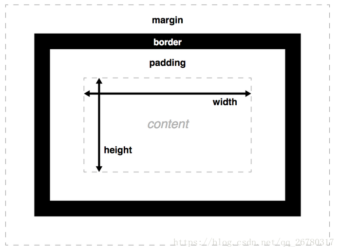
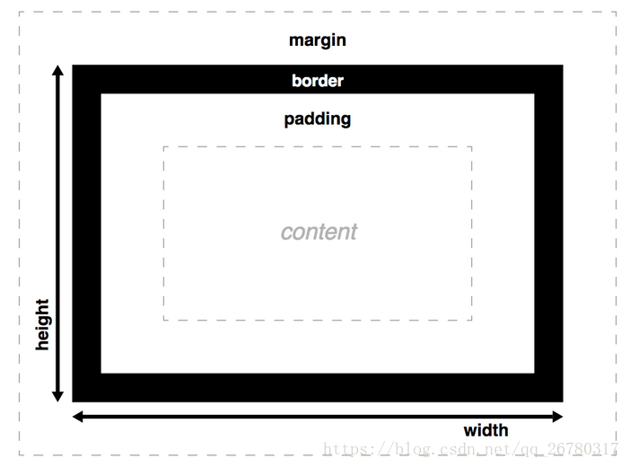

# box-sizing属性
## 浏览器支持

Internet Explorer、Opera 以及 Chrome 支持 box-sizing 属性。  
Firefox 支持替代的 -moz-box-sizing 属性。

## 定义及方法

box-sizing 属性允许您以特定的方式定义匹配某个区域的特定元素。

## 语法
```css
box-sizing: content-box|border-box|inherit;
```
+ content-box:这是由 CSS2.1 规定的宽度高度行为。宽度和高度分别应用到元素的内容框。在宽度和高度之外绘制元素的内边距和边框。  
+ border-box:为元素设定的宽度和高度决定了元素的边框盒。就是说，为元素指定的任何内边距和边框都将在已设定的宽度和高度内进行绘制。通过从已设定的宽度和高度分别减去边框和内边距才能得到内容的宽度和高度。
+ inherit:规定应从父元素继承 box-sizing 属性的值。

## 图示

**centent-box（W3C标准盒模型）**

 

**border-box（IE盒模型）**

 